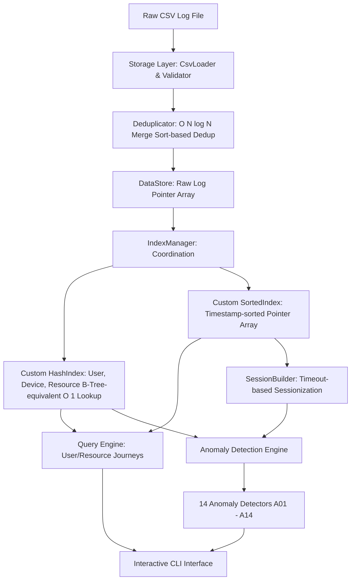

# 🛡️ HALO — CYBER ACCESS ENGINE

<div align="center">



[](https://en.cppreference.com/w/cpp/17)
[](https://cmake.org/)
[-10b981?style=for-the-badge>)](https://valgrind.org/)
[](https://github.com/QCodesDS/halo-access-system)
[](https://github.com/QCodesDS/halo-access-system)
[](https://github.com/QCodesDS/halo-access-system)
[](LICENSE)

**Halo Cyber Access Engine** là hệ thống phân tích dữ liệu log truy cập nội bộ tốc độ cao và phát hiện bất thường an ninh mạng, được xây dựng hoàn toàn bằng **C++17 thuần** nhằm tối ưu hóa hiệu năng cực hạn trên các tập dữ liệu cực lớn (> 1.000.000 dòng).

</div>

---

## 📝 Tổng quan (Overview)

Trong bối cảnh an ninh mạng doanh nghiệp, hàng triệu sự kiện truy cập (access logs) được ghi nhận mỗi ngày từ các hệ thống máy chủ, máy trạm và ứng dụng. Khi xảy ra sự cố bảo mật hoặc tấn công leo thang đặc quyền, việc truy tìm thủ công là bất khả thi do khối lượng dữ liệu khổng lồ.

**Halo Cyber Access Engine** được phát triển nhằm giải quyết triệt để bài toán này. Hệ thống hoạt động như một _mini database engine_ tầng thấp, tự thiết kế cấu trúc dữ liệu và giải pháp lập chỉ mục tối ưu, bỏ qua toàn bộ các thư viện cấu trúc dữ liệu tiện ích của C++ Standard Library (không dùng `std::vector`, `std::map`, `std::set`, `std::unordered_map`).

### ⚠️ Ràng buộc kỹ thuật khắt khe

- **Cấu trúc dữ liệu tự thiết kế:** Mảng động co giãn tự động (`DataStore`), Bảng băm đa chiều (`HashTable` dùng Polynomial Hash và Separate Chaining), Chỉ mục sắp xếp phẳng (`SortedIndex` sử dụng thuật toán Merge Sort).
- **Quản lý bộ nhớ thủ công:** 100% vùng nhớ được cấp phát thông qua con trỏ và toán tử `new[]` / `delete[]` thủ công, cam kết giải phóng triệt để sau mỗi lượt chạy tính năng (**0 memory leak - Valgrind Approved**).
- **Tốc độ xử lý ấn tượng:** Đọc, kiểm chứng, khử trùng lặp và lập chỉ mục hơn **1.000.000 bản ghi trong chưa đầy 5 giây**, truy vấn tìm kiếm nhị phân trong khoảng thời gian diễn ra dưới **10 mili-giây**.

---

## 📊 Tính năng cốt lõi (Key Features)

|   Mã số    | Nhóm tính năng        | Mô tả chi tiết kỹ thuật                                                                                                                           |    Trạng thái     |
| :--------: | :-------------------- | :------------------------------------------------------------------------------------------------------------------------------------------------ | :---------------: |
| **FR-01**  | **Load & Validate**   | Tải log từ file CSV quy mô lớn. Tự động bỏ qua các dòng lỗi schema, lọc bản ghi invalid, timestamp âm, event_type lạ.                             |   ✅ Hoàn thành   |
| **FR-02**  | **Pre-processing**    | Khử trùng lặp hoàn hảo (Deduplication) trong $O(N \log N)$ và sắp xếp dữ liệu tăng dần theo timestamp bằng Merge Sort ổn định.                    |   ✅ Hoàn thành   |
| **FR-03**  | **User Journey**      | Lập chỉ mục băm và truy vết toàn bộ hành trình hoạt động của một User: máy trạm dùng $\rightarrow$ ứng dụng $\rightarrow$ tài nguyên đích.        |   ✅ Hoàn thành   |
| **FR-04**  | **Resource Journey**  | Truy vết lịch sử truy cập của một tài nguyên hệ thống (Resource), hiển thị danh sách các tài khoản và thiết bị đã thao tác theo dòng thời gian.   |   ✅ Hoàn thành   |
| **FR-05**  | **Top 10 Resources**  | Xếp hạng 10 tài nguyên được truy cập nhiều nhất trong khoảng thời gian $[t_{start}, t_{end}]$ tùy chọn bằng cấu trúc tần suất tự tạo.             |   ✅ Hoàn thành   |
| **FR-06**  | **Threshold Anomaly** | Phát hiện bất thường theo ngưỡng cố định: Multi-device Login (A01), Consecutive Failed Login (A02), Resource Flood (A03), Off-hours Access (A04). |   ✅ Hoàn thành   |
| **FR-07**  | **Behavior Anomaly**  | Phân tích hành vi địa lý bất thường: Impossible Travel (A05 - di chuyển không khả thi vật lý), Location Churning (A06 - đổi quốc gia liên tục).   |   ✅ Hoàn thành   |
| **FR-08**  | **Session Anomaly**   | Gom cụm sự kiện thành các phiên làm việc (30 phút idle gap). Phát hiện Long Session (A07), Session Flood (A08), Dangerous Sequence (A09).         |   ✅ Hoàn thành   |
| **FR-09**  | **Advanced Bonus**    | Nhận diện Brute Force (A10), Dormant User Activation (A11), Leo thang đặc quyền (A12), Đánh cắp dữ liệu (A13), Dịch chuyển ngang (A14).           |   🎯 Hoàn thành   |
| **NFR-01** | **Performance**       | Thời gian tải dữ liệu và lập chỉ mục cho 1M dòng log dưới 10 giây. Thực tế đạt **~5 giây**.                                                       | ⚡ Vượt chỉ tiêu  |
| **NFR-03** | **Memory Leak**       | Quản lý bộ nhớ hoàn hảo, thu hồi 100% dung lượng RAM đã chiếm dụng khi thoát chương trình hoặc sau mỗi chức năng.                                 | 💎 Đạt tiêu chuẩn |

---

## 📐 Kiến trúc & Luồng dữ liệu (Architecture & Data Flow)

Hệ thống được thiết kế theo mô hình phân lớp hướng hiệu năng (Performance-Driven Layered Architecture) nhằm đảm bảo sự tách biệt về mặt trách nhiệm (Single Responsibility Principle) và khả năng tối ưu hóa sâu ở tầng thấp.



### Chi tiết các lớp kiến trúc:

1. **Storage Layer (`src/storage/`):** Chịu trách nhiệm trực tiếp tương tác với file vật lý, parse dòng dữ liệu thô thành struct có kiểu dữ liệu rõ ràng, thực thi bộ lọc và validation nghiêm ngặt để đảm bảo tính toàn vẹn của dữ liệu đầu vào.
2. **Indexing Layer (`src/indexing/`):** Nhận mảng LogRecord sạch từ Storage để xây dựng các đường dẫn truy cập siêu tốc. Thiết lập 3 bảng băm đa hướng để phục vụ tìm kiếm chính xác thực thể và mảng phẳng sắp xếp thời gian phục vụ truy vấn khoảng thời gian (Range Queries).
3. **Session Layer (`src/session/`):** Lớp trung gian thực hiện gom cụm dữ liệu phi cấu trúc thành các phiên làm việc (Sessionization) của từng người dùng, là tiền đề để triển khai các thuật toán phân tích chuỗi hành vi bất thường.
4. **Query & Anomaly Engine (`src/query/` & `src/anomaly/`):** Tầng logic nghiệp vụ cấp cao. Query Engine thực thi tìm kiếm nhị phân khoảng thời gian để kết xuất hành trình; Anomaly Engine điều phối 14 bộ dò quét song song trên chỉ mục băm và luồng phiên làm việc để xuất báo cáo vi phạm an ninh.
5. **CLI Layer (`src/cli/`):** Giao diện dòng lệnh trực tác thế hệ mới, nhận lệnh thô từ người dùng, điều phối phân tích và in kết xuất dữ liệu trực quan bằng các ký tự bảng giả đồ họa chuẩn hóa.

---

## 🚀 Khởi động nhanh (Quick Start)

### 📋 Yêu cầu hệ thống

- Trình biên dịch hỗ trợ chuẩn **C++17** (g++ 9+ hoặc MSVC 2019+)
- Công cụ build tự động **CMake 3.16** trở lên

### 🛠️ Hướng dẫn Biên dịch (Build)

Để hệ thống đạt hiệu năng tối đa khi làm việc với 1.000.000 dòng log, bắt buộc phải biên dịch ở chế độ **Release mode** (`-O3` hoặc `/O2` đối với MSVC):

```bash
# 1. Clone mã nguồn từ GitHub
git clone https://github.com/QCodesDS/halo-access-system.git
cd halo-access-system

# 2. Khởi tạo cấu hình build CMake với chế độ Release
cmake -B build -S . -DCMAKE_BUILD_TYPE=Release

# 3. Tiến hành biên dịch chương trình
cmake --build build --config Release
```

Sau khi biên dịch thành công, chương trình thực thi nằm tại thư mục `release/` (trên Windows sẽ là `release/halo.exe` hoặc `release/bin/halo`).

### 💻 Hướng dẫn Chạy & Demo Commands

Khởi động chương trình từ terminal:

```bash
./release/halo
```

Giao diện CLI của Halo sẽ hiển thị, gõ lệnh `help` để liệt kê hoặc làm theo các bước demo dưới đây:

```text
=== Halo Cyber Access Engine ===
Type 'help' for available commands

> help
Available commands:
  load <filepath>                          - Load CSV file
  query user <uid> <t_start> <t_end>       - User journey query
  query resource <rid> <t_start> <t_end>   - Resource journey query
  top resources <t_start> <t_end>          - Top resources by count
  detect anomaly [--type=...]              - Run anomaly detection
  help                                     - Show this help message
  exit                                     - Exit program

# 1. Tải tệp dữ liệu kiểm thử
> load src/data/cyber_activity_1m.csv
[INFO] Loaded 1000000 records (125 skipped, 342 duplicates removed)
[INFO] Indexes built successfully in 1.45s

# 2. Truy vết hành trình người dùng U007
> query user U007 1713100000 1713250000
=== USER JOURNEY FOR U007 ===
[1713225863] D018 -> APP003 -> R025 (DOWNLOAD @ SG)
[1713232145] D018 -> APP001 -> R102 (ACCESS @ SG)
===========================================

# 3. Thống kê Top 10 tài nguyên được truy cập nhiều nhất
> top resources 1713100000 1713250000
=== TOP 10 ACCESSED RESOURCES ===
Rank | Resource ID | Access Count
---------------------------------
1    | R015        | 452
2    | R003        | 398
3    | R089        | 210
...
================================-

# 4. Quét và phát hiện các mối nguy hại an ninh bảo mật
> detect anomaly --type=all
=== CYBER SECURITY ANOMALY DETECTION REPORT ===
--------------------------------------------------------------------------------
[CRITICAL] A05: Impossible Travel | User: U182
  Detail: User U182 active at location CN (1713108845) and then US (1713110245) within 23 minutes.
--------------------------------------------------------------------------------
[HIGH]    A03: Resource Flood   | Device: D091
  Detail: Device D091 accessed 24 unique resources in 15 minutes window.
--------------------------------------------------------------------------------
[WARNING] A09: Dangerous Sequence| User: U007
  Detail: User U007 executed ADMIN_ACTION followed by DOWNLOAD within 3 minutes in Session 2.
--------------------------------------------------------------------------------
[INFO] Detection completed in 4.12s. Found 3 security incidents.
```

---

## 🔍 Chi tiết các Module & Thuật toán (Module Walkthrough)

### 1. Storage & Khử trùng lặp thông minh (`src/storage/`)

Dữ liệu log từ thực tế rất lộn xộn. `CsvLoader` và `Validator` thực hiện đọc từng dòng bằng `std::ifstream`, sử dụng hàm `split` chuỗi thô tự viết để bóc tách 7 trường dữ liệu. Mọi trường hợp không khớp kiểu dữ liệu hoặc vi phạm ràng buộc an toàn (như ranh giới timestamp, quốc gia không thuộc danh sách quy định) đều bị loại bỏ ngay lập tức.

Để đảm bảo hiệu năng và tiết kiệm dung lượng bộ nhớ lớn, `Deduplicator` tiến hành loại bỏ các bản ghi trùng lặp hoàn toàn (tất cả 7 trường giống nhau) bằng thuật toán **Merge Sort cải tiến** hoạt động trực tiếp trên mảng con trỏ `LogRecord**` với độ phức tạp cực hạn $O(N \log N)$, sau đó thực hiện so sánh hai bản ghi lân cận chỉ trong $O(N)$ để giải phóng RAM. Phương pháp này tối ưu hơn gấp hàng chục lần so với duyệt mảng hai vòng lặp $O(N^2)$ thông thường.

### 2. Chỉ mục băm và mảng phẳng sắp xếp (`src/indexing/`)

Thay vì thực hiện quét tuyến tính chậm chạp $O(N)$ mỗi khi có truy vấn tìm kiếm, hệ thống thiết lập hai cấu trúc index đột phá:

- **HashTable (`src/indexing/HashTable.h`):** Bảng băm tùy biến sử dụng kỹ thuật băm chuỗi đa thức (**Polynomial Rolling Hash**) kết hợp giải quyết đụng độ bằng danh sách liên kết đơn (**Separate Chaining**). Kích thước bảng băm được tính toán động dựa trên số dòng log để đảm bảo hệ số tải (Load Factor) lý tưởng $< 0.75$, đưa thời gian tra cứu thực thể theo `user_id`, `device_id`, `resource_id` đạt mức tối ưu trung bình $O(1)$.
- **SortedIndex (`src/indexing/SortedIndex.h`):** Một mảng phẳng chứa toàn bộ các con trỏ trỏ đến `LogRecord`, được sắp xếp tăng dần theo trường `timestamp` bằng **Merge Sort đệ quy** cực nhanh. Khi người dùng thực hiện truy vấn khoảng thời gian $[t_{start}, t_{end}]$, hệ thống sử dụng thuật toán **Tìm kiếm nhị phân** (`binarySearchStart` và `binarySearchEnd`) để xác định ranh giới bắt đầu và kết thúc của vùng dữ liệu thỏa mãn chỉ trong thời gian $O(\log N)$, tránh duyệt toàn bộ mảng dữ liệu.

### 3. Tái dựng phiên làm việc (`src/session/`)

Thành phần `SessionBuilder` gom cụm luồng sự kiện của từng người dùng thành các phiên làm việc logic độc lập để phân tích sâu.

- **Ranh giới phiên làm việc:** Phiên bắt đầu khi tài khoản xuất hiện sự kiện `LOGIN` (hoặc sự kiện đầu tiên ghi nhận trong ngày nếu thiếu LOGIN).
- **Kết thúc phiên làm việc:** Phiên khép lại khi gặp sự kiện `LOGOUT` tương ứng, hoặc khi xuất hiện khoảng thời gian trống không hoạt động (**idle gap**) vượt quá **30 phút**.
  Cơ chế này cho phép tái dựng toàn bộ chuỗi hành vi tuần tự và là nền tảng để phát hiện các cuộc tấn công tinh vi theo thời gian.

### 4. 14 Luật phát hiện bất thường an ninh (`src/anomaly/`)

Hệ thống tích hợp **14 bộ dò quét an ninh** thông minh được lập trình trực tiếp bằng các giải pháp duyệt tối ưu trên index:

> [!NOTE]

> **Nhóm Threshold-Based (Dựa trên ngưỡng cứng)**
>
> - **A01: Multi-device Login:** Phát hiện tài khoản hoạt động từ $>3$ thiết bị khác nhau trong vòng 60 phút.
> - **A02: Consecutive Failed Login:** Cảnh báo khi tài khoản thực hiện sai mật khẩu liên tiếp $>5$ lần `FAILED_LOGIN`.
> - **A03: Resource Flood:** Cảnh báo khi một thiết bị đột ngột quét/truy cập $>20$ tài nguyên khác nhau trong 30 phút.
> - **A04: Off-hours Access:** Ghi nhận toàn bộ các truy cập đáng ngờ diễn ra ngoài giờ làm việc hành chính quy định (08:00 - 18:00 UTC).

> [!TIP]
> **Nhóm Behavior-Based (Dựa trên phân tích hành vi địa lý)**
>
> - **A05: Impossible Travel:** Phát hiện tài khoản hoạt động tại 2+ quốc gia khác nhau trong 120 phút (khoảng thời gian không thể di chuyển bằng máy bay thương mại thông thường).
> - **A06: Location Churning:** Phát hiện tài khoản thay đổi vị trí địa lý liên tục quá 3 lần trong vòng 60 phút.

> [!IMPORTANT]
> **Nhóm Session-Based (Phân tích theo phiên làm việc)**
>
> - **A07: Long Session:** Cảnh báo phiên làm việc hoạt động liên tục bất thường vượt quá 8 tiếng (dấu hiệu của chiếm quyền điều khiển phiên - session hijacking).
> - **A08: Session Flood:** Phát hiện tài khoản tạo $>5$ phiên làm việc mới liên tục trong 60 phút.
> - **A09: Dangerous Sequence:** Nhận diện chuỗi hành động đáng nghi trong cùng một phiên: thực hiện đặc quyền quản trị `ADMIN_ACTION` sau đó lập tức thực hiện tải dữ liệu `DOWNLOAD` trong vòng 10 phút.

> [!WARNING]
> **Nhóm Advanced & Bonus (Phát hiện tấn công phức tạp)**
>
> - **A10: Brute Force:** Phát hiện chuỗi $>5$ lần `FAILED_LOGIN` liên tiếp kết thúc bằng 1 lần `LOGIN` thành công (tấn công dò mật khẩu thành công).
> - **A11: Dormant User Activation:** Cảnh báo khi tài khoản ngủ đông $>7$ ngày đột ngột hoạt động mạnh trở lại với tần suất $>20$ sự kiện/giờ.
> - **A12: Privilege Escalation (Leo thang đặc quyền):** Cảnh báo tài khoản thông thường đột ngột thực hiện chuỗi hành vi cấu hình quản trị hệ thống nguy hiểm.
> - **A13: Data Exfiltration (Đánh cắp dữ liệu):** Nhận diện hành vi download dồn dập dữ liệu nhạy cảm trong phiên làm việc với dung lượng lớn.
> - **A14: Lateral Movement (Dịch chuyển ngang):** Phát hiện thiết bị quét liên tục và truy cập bất thường hàng loạt tài nguyên nội bộ thuộc các phân vùng mạng khác nhau.

---

## 🗺️ Lộ trình phát triển (Roadmap)

- [x] **Phase 01:** Thiết lập hạ tầng cơ bản (Data models, CsvLoader, Validator, DataStore thủ công).
- [x] **Phase 02:** Xây dựng cơ chế lập chỉ mục siêu tốc (Bảng băm Polynomial Hash, SortedIndex Merge Sort).
- [x] **Phase 03:** Thiết lập Query Engine tìm kiếm nhị phân & CLI tương tác (Đạt chuẩn Midterm).
- [x] **Phase 04:** Tối ưu hóa hiệu năng cực hạn trên tập dữ liệu lớn 1.000.000 dòng log.
- [x] **Phase 05:** Thiết kế bộ xây dựng phiên làm việc và triển khai 14 luật dò tìm bất thường (Final Submission).
- [x] **Phase 06:** Rà soát bộ nhớ thủ công nghiêm ngặt, đóng gói biên dịch và viết tài liệu hướng dẫn.
- [ ] **Phase 07 (Tương lai):** Phát triển phiên bản RESTful API C++ sử dụng `Crow` hoặc `drogon` framework.
- [ ] **Phase 08 (Tương lai):** Tích hợp Web Dashboard trực quan hóa dạng đồ thị thời gian thực (Real-time network graph).

---

## 📄 Bản quyền (License)

Dự án này được phân phối theo giấy phép mã nguồn mở **MIT License** — xem chi tiết tại tệp [LICENSE](LICENSE) trong thư mục gốc.

---

<div align="center">
  Được phát triển với 💖 bởi <b>QCodesDS</b>. Hãy thả một ⭐ nếu bạn thấy dự án hữu ích!
</div>
